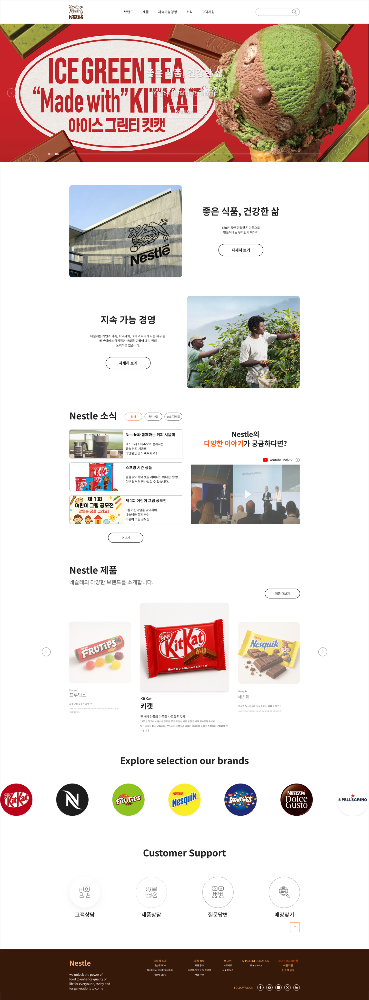

# Nestlé 홈페이지 리뉴얼 프로젝트

## 🔗 빠른 링크
- 📑 기획서(피그마 슬라이드): https://www.figma.com/slides/w2F4dHtW2v49EIQjht4CZz/%EB%B6%88%ED%83%9C%EC%9A%B0%EC%A1%B0_1%EC%B0%A8%ED%94%84%EB%A1%9C%EC%A0%9D%ED%8A%B8_ppt?node-id=45-7&t=s2V9KC2eaol5uiNv-1 
- 🎨 디자인 시안(피그마): https://www.figma.com/design/mNXabWwo6hMDaMMnCI31Xf/1%EC%B0%A8-%ED%94%84%EB%A1%9C%EC%A0%9D%ED%8A%B8_%EB%84%A4%EC%8A%AC%EB%A0%88%EB%94%94%EC%9E%90%EC%9D%B8?node-id=118-4&t=INpKFc1KKtJtadsd-1
- 🌐 배포 URL: https://timcho19.github.io/Renewal_project_Nestle/

---

## 1. 프로젝트 개요

### 1.1 목표
- **브랜드 가치 강화**: 네슬레의 역사와 제품을 직관적으로 전달
- **UX/UI 개선**: 접근성과 가독성을 높이고, 사용자 흐름이 매끄럽도록 설계
- **정적 웹 페이지 개발**: HTML, CSS, JavaScript만으로 구현하여 가볍고 빠른 로딩 속도 제공

### 1.2 👥 팀원
| 이름 | 역할 | 주요 담당 | GitHub | 연락 |
| --- | --- | --- | --- | --- |
| 장원석 | 팀장 · 공통 | 프로젝트 기획, 메인 페이지 제작 | [@timcho19](https://github.com/timcho19) | timcho4589@gmail.com |
| 박경선 | 공통 | 서브 페이지(제품/브랜드/ESG) 제작 | [@githubB](https://github.com/githubB) | email@example.com |
| 조아랑 | 공통 | 디자인 시안 제작, 반응형 레이아웃 설계 | [@githubC](https://github.com/githubC) | email@example.com |
| 박연미 | 공통 | 디자인 시안 제작, 반응형 레이아웃 설계 | [@githubC](https://github.com/githubC) | email@example.com |

---

## 2. 개발 환경

### 2.1 기술 스택
- **HTML5**: 시멘틱 태그를 사용한 구조화
- **CSS3**: Flexbox, Grid, 반응형 미디어쿼리, 애니메이션 효과
- **JavaScript(ES6+)**: DOM 조작, 인터랙션, 슬라이드/탭 UI
- **Design Tool**: Figma
- **Version Control**: Git & GitHub
- **Deployment**: GitHub Pages

---

## 3. 주요 기능

- **메인 페이지**
  - Hero 비주얼(메인 배너)
  - 제품·브랜드 소개 섹션
  - ESG & 사회공헌 콘텐츠
  - 뉴스·이벤트 영역
  - 고객지원 링크

- **서브 페이지**
  - 제품 카탈로그 + 상세 페이지
  - 브랜드 히스토리
  - ESG 활동 소개
  - 뉴스/이벤트 상세 페이지

- **UI/UX 요소**
  - 반응형 메뉴 네비게이션
  - 스크롤 애니메이션
  - 이미지 슬라이드(캐러셀)
  - 탭 전환 UI

---

## 4. 폴더 구조
```
Renewal_project_Nestle/
├─ index.html              # 메인 페이지
├─ css/
│  ├─ common.css
│  ├─ main.css
│  └─ reset.css
├─ js/
│  └─ main.js
├─ images/
│  ├─ logo.png
│  └─ ...
├─ video/
│  ├─ koreanestlekitkat.mp4
│  └─ ...
└─ README.md
```

---

## 5. 실행 방법
```bash
# 1. 프로젝트 클론
git clone https://github.com/timcho19/Renewal_project_Nestle.git

# 2. 프로젝트 폴더로 이동
cd Renewal_project_Nestle

# 3. index.html을 브라우저로 열기
```
※ 로컬 서버에서 실행하려면 VS Code의 Live Server 확장 등을 사용하면 편리합니다.

---

## 6. 향후 개선 사항
- 다국어(i18n) 지원
- CSS 변수/SCSS 적용으로 유지보수성 강화
- JavaScript 모듈화 및 코드 최적화
- 접근성(A11y) 개선 (키보드 내비게이션, 명도 대비)
- 이미지 최적화로 로딩 속도 향상

---

## 7. 기획/디자인 문서
- **기획서(피그마 슬라이드)**: https://www.figma.com/slides/w2F4dHtW2v49EIQjht4CZz/%EB%B6%88%ED%83%9C%EC%9A%B0%EC%A1%B0_1%EC%B0%A8%ED%94%84%EB%A1%9C%EC%A0%9D%ED%8A%B8_ppt?node-id=45-7&t=s2V9KC2eaol5uiNv-1 
- **디자인 시안(피그마)**: https://www.figma.com/design/mNXabWwo6hMDaMMnCI31Xf/1%EC%B0%A8-%ED%94%84%EB%A1%9C%EC%A0%9D%ED%8A%B8_%EB%84%A4%EC%8A%AC%EB%A0%88%EB%94%94%EC%9E%90%EC%9D%B8?node-id=118-4&t=INpKFc1KKtJtadsd-1

### 7.1 미리보기
[](https://www.figma.com/file/XXXX "피그마 슬라이드")

