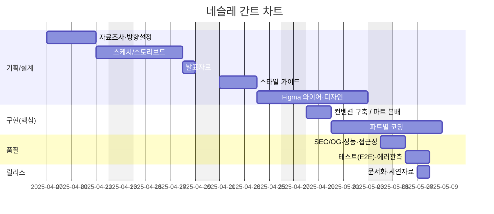
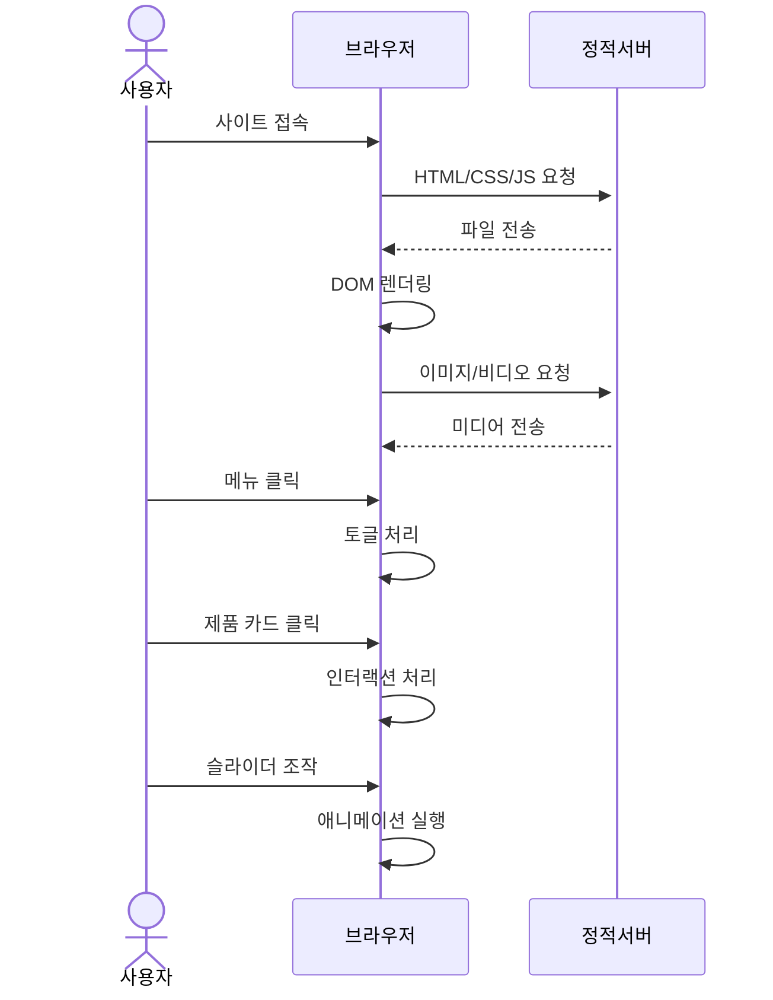
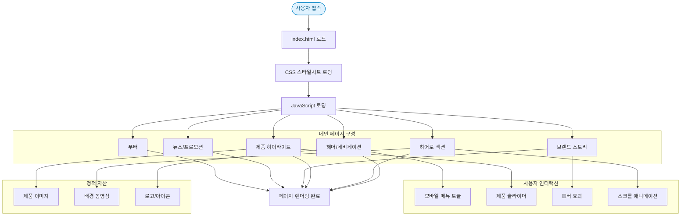
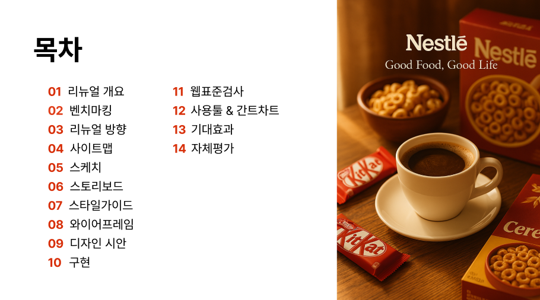
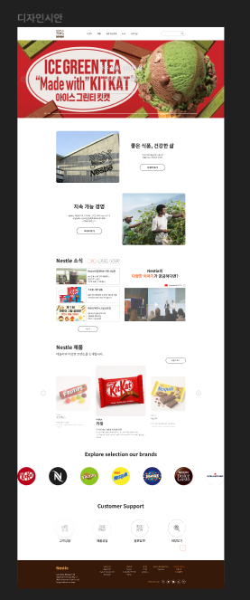

## 🔗 빠른 링크
- 📑 기획서(피그마 슬라이드): https://www.figma.com/slides/w2F4dHtW2v49EIQjht4CZz/%EB%B6%88%ED%83%9C%EC%9A%B0%EC%A1%B0_1%EC%B0%A8%ED%94%84%EB%A1%9C%EC%A0%9D%ED%8A%B8_ppt?node-id=45-7&t=s2V9KC2eaol5uiNv-1

- 🎨 디자인 원본(피그마): https://www.figma.com/design/mNXabWwo6hMDaMMnCI31Xf/1%EC%B0%A8-%ED%94%84%EB%A1%9C%EC%A0%9D%ED%8A%B8_%EB%84%A4%EC%8A%AC%EB%A0%88%EB%94%94%EC%9E%90%EC%9D%B8?node-id=118-4&t=INpKFc1KKtJtadsd-1

---


# Nestlé Website Renewal
> HTML/CSS/JS 정적 웹사이트 리뉴얼 프로젝트

## 목차
- [프로젝트 개요](#프로젝트-개요)
- [폴더 구조](#폴더-구조)
- [주요 기능](#주요-기능)
- [페이지 맵](#페이지-맵)
- [빠른 시작](#빠른-시작)
- [개발 가이드](#개발-가이드)
- [빌드 & 배포](#빌드--배포)
- [브라우저 지원](#브라우저-지원)
- [품질 체크리스트](#품질-체크리스트)
- [크레딧](#크레딧)

---

## 1. 프로젝트 개요
Nestlé 브랜드 웹사이트를 **정적 페이지(HTML/CSS/JS)** 로 리뉴얼한 프로젝트입니다. 브랜드 스토리 전달력과 제품 가독성을 높이기 위해 **간결한 레이아웃, 대조가 뚜렷한 타이포, 대형 히어로 이미지/영상**을 활용했습니다.  
디렉터리 구성은 `index.html` 과 `css/`, `js/`, `images/`, `video/` 로 나뉘며, 간단한 스크립트로 내비게이션, 슬라이더 등 인터랙션을 제공합니다.

- **주요 기술**: HTML5, CSS3, JavaScript(ES6)
- **디자인 목표**: 브랜드 아이덴티티 반영, 접근성(명도 대비/키보드 내비게이션), 반응형 레이아웃
- **성과 지표 예시**: LCP 2.5s 이내, CLS 0.1 이하, Lighthouse 90+ (Performance/Accessibility/SEO)

---

### 1.1 👥 팀원

| 이름 | 역할 | 주요 담당 | GitHub | 연락 |
| --- | --- | --- | --- | --- |
| 장원석 | 팀장 · 공통 | 프로젝트 기획, 메인 페이지 제작 | [@timcho19](https://github.com/timcho19) | timcho4589@gmail.com |
| 박경선 | 공통 | 서브 페이지(제품/브랜드/ESG) 제작 | [@Ha-im](https://github.com/Ha-im) | gungsun1@naver.com |
| 조아랑 | 공통 | 디자인 시안 제작, 반응형 레이아웃 설계 | [@likerang](https://github.com/likerang) | like_rang@naver.com |
| 박연미 | 공통 | 디자인 시안 제작, 반응형 레이아웃 설계 | - | - |

---
### 1.2 🗓️ 마일스톤



---

## 2. 🎯 주요 기능
- **헤더/내비게이션**: 스티키 헤더, 모바일 메뉴 토글
- **히어로 섹션**: 대형 이미지/동영상 배경, 핵심 메시지
- **제품 소개**: 카드 레이아웃, 호버 인터랙션, 간단한 필터/탭
- **스토리/ESG 섹션**: 브랜드 가치 및 지속가능성 소개
- **푸터**: 약관/개인정보/소셜 링크
- **접근성 배려**: 시맨틱 마크업, 스킵 링크, 대체 텍스트, 명도 대비

---

## 3. 데이터 흐름



---

## 4. 폴더 구조
```
/ (repo root)
├─ index.html          # 진입점
├─ css/                # 스타일 시트 (reset, layout, components 등)
├─ js/                 # 스크립트 (nav, carousel, modal 등)
├─ images/             # 이미지 자산 (logo, 제품, 배너)
└─ video/              # 히어로/배경 영상 등
```
> 실제 리포지토리 내에는 `index.html`, `css/`, `js/`, `images/`, `video/` 폴더가 포함되어 있습니다.

---
## 5. 아키텍쳐 

---

## 6. 개발 환경 & 실행 방법
로컬에서 바로 열람하거나, VS Code **Live Server** 확장으로 개발합니다.

### 1) 의존성 없음 (정적 프로젝트)
```bash
# 클론
git clone https://github.com/likerang/Renewal_project_Nestle.git
cd Renewal_project_Nestle

# 바로 열기
# macOS
open index.html

# Windows
start index.html
```

### 2) VS Code Live Server (권장)
1. VS Code에서 폴더 열기
2. 확장 탭에서 **Live Server** 설치
3. `index.html` 우클릭 → **Open with Live Server**

---

## 7. 빌드 & 배포
정적 사이트이므로 **정적 호스팅**을 사용합니다.

- **GitHub Pages**  
  - Settings → Pages → Branch 선택 → 저장  
  - 기본 도메인: `https://timcho19.github.io/Renewal_project_Nestle/`

---

## 8. 향후 개선 사항

- 다국어(i18n) 지원
- 반응형 개선: 모바일/태블릿 최적화 강화
- 서브페이지 구현
- CSS 변수/SCSS 적용으로 유지보수성 강화
- JavaScript 모듈화 및 코드 최적화
- 이미지 최적화로 로딩 속도 향상


---

## 9. 제작 후기

이번 프로젝트를 통해 HTML, CSS, Javascript를 사용하여 웹 페이지를 제작할 때 필요한 점을 배울 수 있었습니다.
더하여, 팀원들과 협력하여 프로젝트를 진행하며, 팀원 간의 협업 경험을 쌓을 수 있었고 기획부터 구현까지 방향성에 맞게 잘 구현한 것 같습니다.

---

## 10. 미리보기
[](https://www.figma.com/slides/w2F4dHtW2v49EIQjht4CZz/%EB%B6%88%ED%83%9C%EC%9A%B0%EC%A1%B0_1%EC%B0%A8%ED%94%84%EB%A1%9C%EC%A0%9D%ED%8A%B8_ppt?node-id=45-7&t=s2V9KC2eaol5uiNv-1 "피그마 슬라이드로 이동")
[](https://www.figma.com/design/mNXabWwo6hMDaMMnCI31Xf/1%EC%B0%A8-%ED%94%84%EB%A1%9C%EC%A0%9D%ED%8A%B8_%EB%84%A4%EC%8A%AC%EB%A0%88%EB%94%94%EC%9E%90%EC%9D%B8?node-id=118-4&t=INpKFc1KKtJtadsd-1 "피그마 디자인으로 이동")

## 10.1크레딧
- 디자인/기획: 팀원 공통
- 개발: 장원석, 박경선, 박연미, 조아랑
- 작업 기간: *2025-04-07 ~ 2025-05-07*
---
